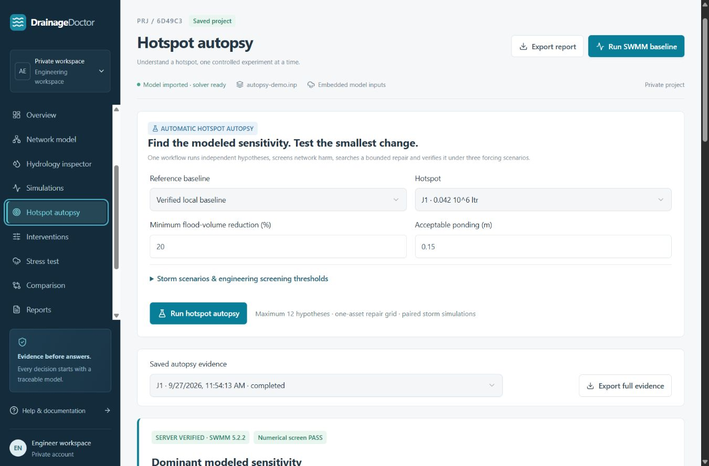
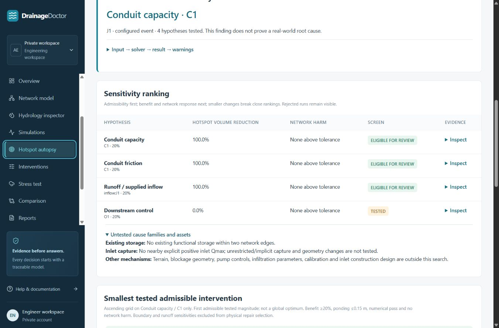

# DrainageDoctor

Find why a site floods. Test the smallest fix. Prove it works **within the supplied model and tested scenarios**.

DrainageDoctor is an engineering decision-support application for EPA SWMM models. It runs controlled hydraulic experiments, ranks modeled sensitivities, searches a declared intervention grid, and checks the chosen alternative under multiple forcing scenarios. Professional engineering review remains required.

## What problem does it solve?

A flooding map identifies symptoms. DrainageDoctor tests competing explanations and records what changed, how the hotspot responded, whether other nodes worsened, and which assumptions remain unverified.

## How it works

1. Create a project and import a self-contained SWMM `.inp` file.
2. Run a trusted baseline and inspect numerical quality and physical warnings.
3. Select a hotspot and run **Hotspot Autopsy**.
4. Review competing hypotheses, rejected experiments, and untested mechanisms.
5. Inspect the smallest admissible magnitude found in the declared one-asset search.
6. Compare actual baseline/intervention runs under three configurable forcing scenarios.
7. Export evidence JSON, immutable INP files, SWMM reports, and binary outputs.

## Implemented features

- Real SWMM 5.2.2 execution in an isolated server child process.
- Authenticated solver queue with cancellation, per-run and per-job timeouts, worker crash retry, immutable artifacts, and SHA-256 verification.
- Automatic neighborhood hypothesis generation: up to two assets per family, twelve initial experiments.
- Six experiment families: circular conduit diameter, Manning roughness, existing functional storage, supported inlet capture limits, fixed-stage tailwater, and imperviousness or external-inflow sensitivity.
- Numerical screening, network-wide worsening checks, and a bounded ascending repair search.
- Three real paired stress scenarios using embedded rainfall or direct FLOW input multipliers.
- Hydrology integrity inspector and configurable engineering plausibility warnings.
- Saved run history, model/engine provenance, evidence downloads, and project audit history.

## Architecture

```text
Browser → authenticated web API → immutable INP → solver queue
                                                   ↓
                                            isolated SWMM worker
                                                   ↓
D1 job metadata ← server evidence parser ← RPT + OUT + content hashes
R2 stores models, reports and completed analysis evidence
```

The web application uses React, TypeScript, Vinext/Vite, Cloudflare Workers, D1 and R2. A separate Node.js service performs trusted SWMM execution. D1 and R2 run locally during development. Solver artifacts reside in a persistent service data directory.

## SWMM execution and trust

The pinned engine is `@fileops/swmm-wasm-web@0.0.4`, reporting SWMM **5.2.2**. Its vendored JavaScript/WASM bundle is checked against `server/engine-manifest.json` before execution. The engine receives an in-memory filesystem without host filesystem or network APIs.

`SERVER VERIFIED` means the configured server executed and parsed the model; it does not certify model accuracy or engineering suitability. Clients cannot submit report text to create completed results. Old browser-executed records retain their historical trust labels.

Limits: 500 nodes, 2,000 conduits, a seven-day event, at least a 30-second reporting interval, 120 seconds per simulation and 15 minutes per analysis job. Failed worker processes are retried once; hydraulic input errors are not retried. Jobs interrupted by a service restart become failed records and require explicit resubmission. Terminal results cannot be overwritten through the API.

The Docker Compose service adds a 512 MB container memory limit, one CPU, process limits, a read-only root filesystem and an unprivileged user. Running directly with Node provides a worker heap limit and wall-clock timeout, but not Docker's whole-process memory/CPU limits. Keep the solver token private and use a protected HTTPS connection when the service is remote. Back up the solver volume along with D1/R2.

## Counterfactual experiments

| Family | Tested change | Supported scope |
| --- | --- | --- |
| Conduit capacity | Increase diameter 5–100% | Existing CIRCULAR conduit |
| Friction | Reduce Manning n 5–30% | Existing conduit |
| Storage | Increase area coefficients 5–100% | Existing FUNCTIONAL storage; depth/exponent preserved |
| Inlet capture | Increase Qmax 5–100% | Positive explicit Qmax on standard inlets or custom DIVERSION curves |
| Downstream control | Lower fixed stage by 5–30% of water depth above invert | FIXED outfalls |
| Runoff/inflow | Reduce impervious fraction or hydrograph multiplier 5–30% | Existing subcatchment or explicit FLOW inflow |

SWMM ignores Qmax for custom RATING inlet curves; these are excluded. Tailwater and runoff experiments diagnose sensitivity but are not automatically recommended as physical repairs. No new storage facility or construction-ready inlet is designed.

Each hypothesis starts from the original baseline. Ranking places admissibility before a disclosed score: hotspot volume reduction + 20 × fractional network volume reduction − 0.1 × intervention percentage. There is no invented cost or confidence estimate.

Repair search examines one responsive physical asset on `[5, 10, 20, 30, 50, 75, 100]%`, clipped to the family bounds, and stops at its first admissible result. This is the smallest **tested** magnitude in that search, not a global optimum. Three paired scenarios then evaluate numerical quality, ponding and network harm. Robustness is reported as a count of tested scenarios passing screens.

## Screenshots / demo

The application includes an illustrative dashboard, labeled as such, plus a separate real-model workflow. The screenshot below shows the actual local application; hydraulic evidence must be obtained by running the model.





## Testing

```sh
npm run typecheck
npm test
npm run build
```

With both local services running, `node --experimental-strip-types scripts/smoke-local.mjs` creates a labeled test project and verifies import → baseline → autopsy → evidence download, including rejection of forged client reports.

GitHub Actions runs all three checks after `npm ci` on pushes and pull requests. Tests execute the real pinned SWMM engine and cover deterministic results, mass balance, unit retention, transferred flooding, Manning capacity, hydrograph integration, pipe/friction/storage/inlet/tailwater sensitivity, extreme and dry inputs, hydrology warnings, and the full autopsy/storm loop. HTTP service tests cover authentication, input immutability, artifact hashes, real worker execution and timeout behavior. A stored native SWMM 5.2.4 report provides an independent benchmark comparison at report precision.

## Engineering limitations

- Results depend on calibration, geometry, boundaries, rainfall and supplied hydrographs. Inspection does not validate their real-world provenance.
- The autopsy identifies the dominant modeled sensitivity **among tested hypotheses**. It does not prove real-world causality.
- Forcing multipliers are sensitivity cases, not verified design storms, return periods or exceedance probabilities. Separate uploaded storm-model comparison is not implemented.
- Only embedded rainfall series and explicit FLOW multipliers are supported for scenario generation. Shared rainfall/boundary series are rejected.
- Flooding volume is summed from the report; with ponding/re-entry, it is not necessarily net water lost from the network.
- Results use report precision. Missing ponded depth remains unavailable; flooding duration and surcharge duration are different quantities.
- Physical thresholds are configurable screening rules, not regulatory requirements. Numerical screening uses routing continuity ±1% and reported DYNWAVE non-convergence ≤1%.
- The conservative other-node screen flags increases in depth, flooding duration or volume, including depth increases that need engineering interpretation.
- Calibration, GIS/terrain, cost data, rainfall libraries, time-series tailwater perturbations, joint intervention optimization and construction design remain outside this release.

Methods: [EPA SWMM documentation](https://www.epa.gov/water-research/storm-water-management-model-swmm), [SWMM 5.2 manual](https://www.epa.gov/system/files/documents/2022-04/swmm-users-manual-version-5.2.pdf), and [EPA inlet solver implementation](https://github.com/USEPA/Stormwater-Management-Model/blob/develop/src/solver/inlet.c). Built-in thresholds are DrainageDoctor screening choices; user settings are recorded in the evidence.

## Local setup

Use Node.js 24.14 or a compatible recent Node release and npm.

```sh
npm ci
npm run setup:local
npm run db:migrate
```

The setup command creates ignored `.env.solver` and `.dev.vars` files with a shared random token. It preserves existing configuration. Start two terminals:

```sh
# Terminal 1
npm run solver
```

```sh
# Terminal 2
npm run dev
```

Open `http://localhost:5173`. Portable development uses the bundled local mock authentication; it is a development environment. Configure real authentication, actual Cloudflare resources, `SOLVER_URL`, and `SOLVER_TOKEN` before a public deployment. The checked-in database UUID is only a local placeholder. Production hosting is a separate infrastructure task.

Alternatively, run the solver with Docker after generating local configuration:

```sh
docker compose up --build solver
```

Keep `solver-data/`, `.env.solver`, `.dev.vars`, and local runtime state out of Git.

## LovHack demo

1. Start both services and create a real project.
2. Import `public/autopsy-demo.inp` (also downloadable in the app).
3. Run the baseline and inspect hotspot J1.
4. Open Hotspot Autopsy, keep the disclosed default thresholds, and start analysis.
5. Inspect ranked hypotheses and the bounded repair search.
6. Open the three-scenario matrix and download the underlying INP/RPT evidence.

This synthetic model uses **external inflows only**. The separate `benchmark-network.inp` intentionally produces extreme ponding for stress tests; it is not a calibrated site. Unsupported families remain listed as untested. No numerical results in the real workflow come from the illustrative dashboard.

## Roadmap

- Calibrated field-model validation and observed-event comparison.
- User-supplied storm models and documented rainfall sources.
- Broader inlet and time-series tailwater support.
- Multi-asset, robustness-aware search with declared feasibility/cost inputs.
- GIS context, calibration workflow and grounded evidence explanations.
